# School Information System

A full-stack school information and application platform developed for **SMA Negeri 1 Biak Kota** using **CodeIgniter 4, PHP, MySQL, JavaScript, HTML, and CSS**.

The platform combines a public website, administrative dashboard, dynamic student admission, computer-based examinations, GPS-based teacher attendance, live content synchronization, Android WebView access, and a Windows Electron client within one integrated system.

> **Portfolio Notice**
>
> This repository is a technical portfolio showcase of a private production-oriented system. Production source code, credentials, cryptographic keys, personal data, internal configuration, and other security-sensitive components are intentionally excluded.

---

## Project Overview

The system was designed as an integrated school platform rather than a collection of isolated pages.

Core areas include:

- Public school website
- Administration dashboard
- PPDB / SPMB student admission
- USBK computer-based examination
- GPS-based teacher attendance
- Live Sync for selected public information
- Automatic WebP image processing and optimization
- Android client using Java + Android WebView
- Windows desktop client using Electron + Node.js
- Authentication, authorization, and access-control engineering
- Security testing and vulnerability assessment
- Debugging and performance optimization

---

## Featured Screenshots

### Public Website

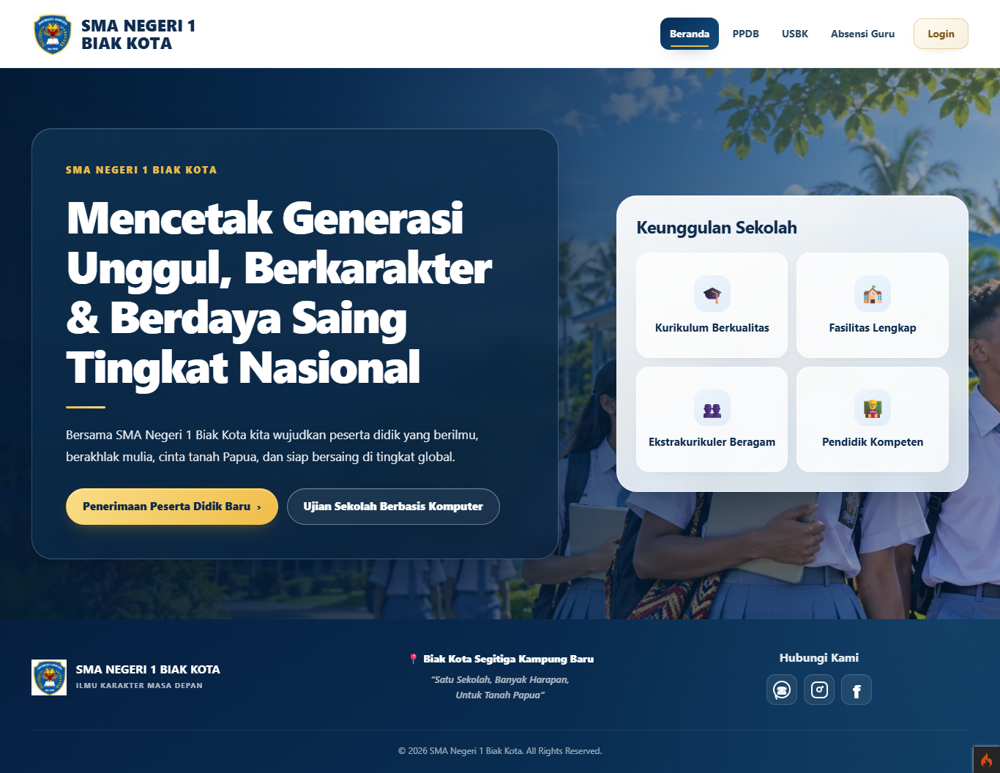

The public interface provides responsive access to school information and operational modules.

### PPDB / SPMB

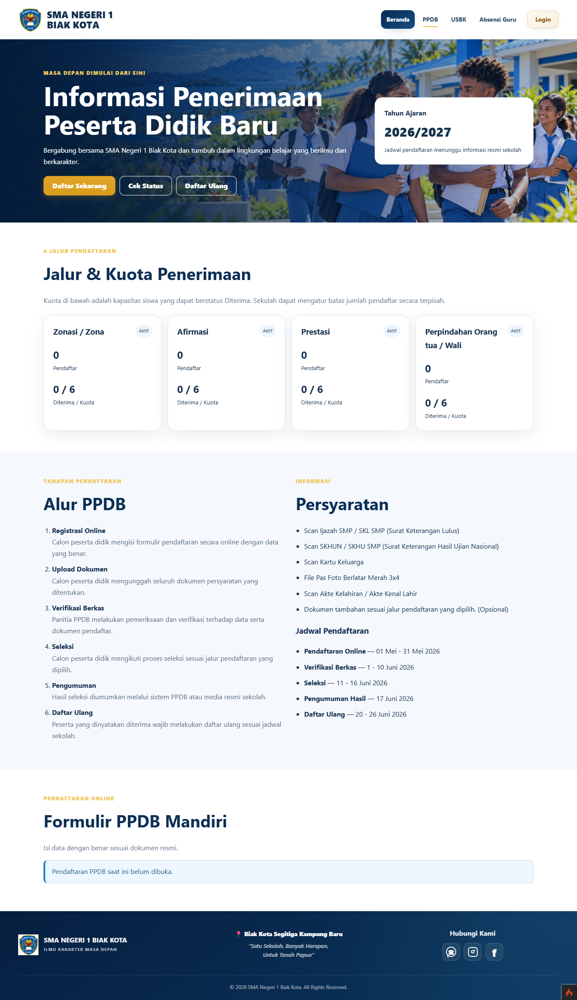

The admission module supports configurable registration workflows, admission paths, schedules, quotas, documents, re-registration, and administrative processing.

### USBK

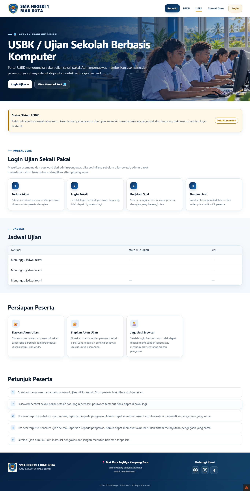

The USBK module supports computer-based examination workflows, including schedules, announcements, participant access, waiting-room handling, and controlled active-exam state.

### GPS-Based Teacher Attendance

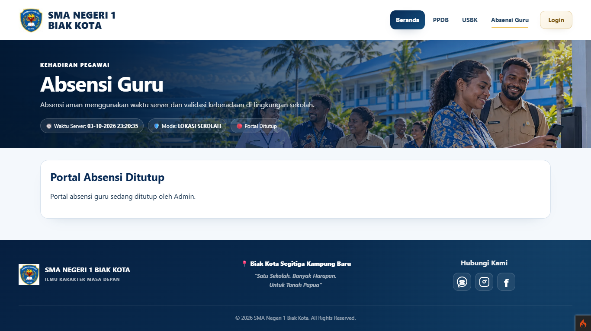

The attendance workflow integrates device location, accuracy handling, check-in/check-out state, attendance status, late attendance handling, and duplicate-submission protection.

---

## Administration Dashboard

### Main Dashboard

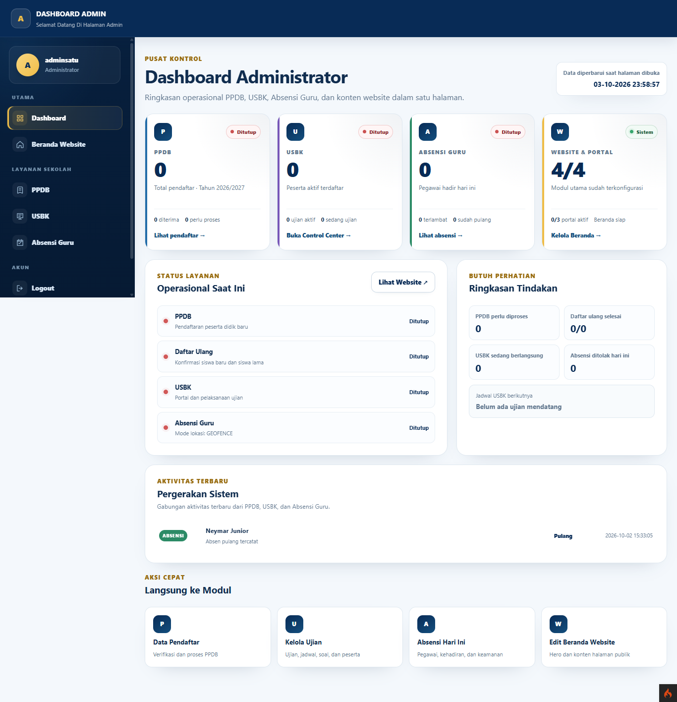

### Content Management

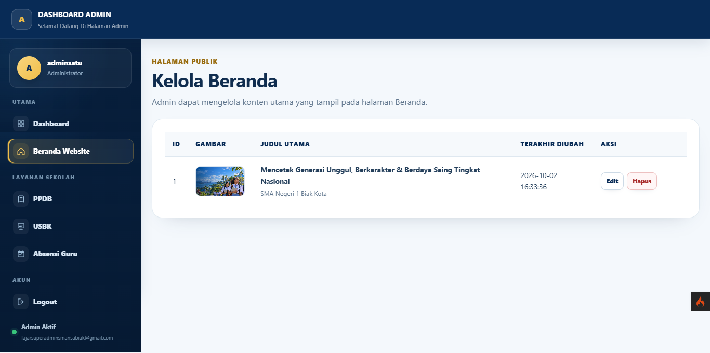

### PPDB Management

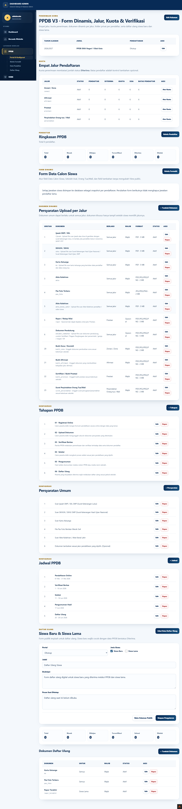

### USBK Management

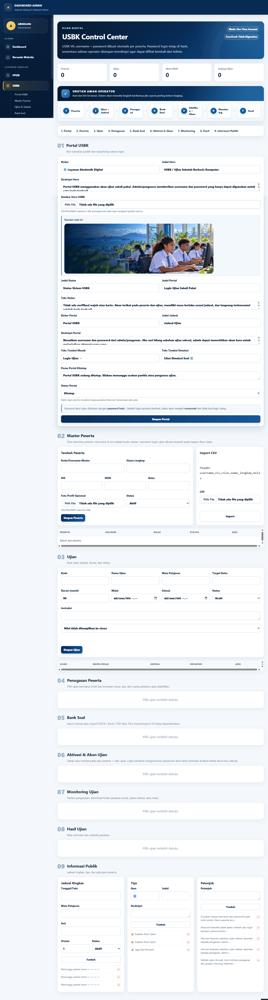

### Attendance Management

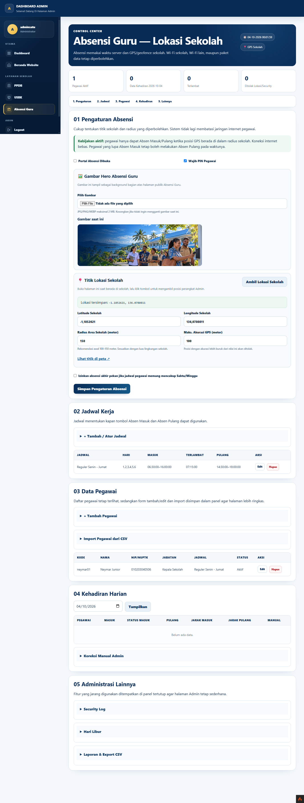

The administration layer centralizes website content, registration configuration, examination management, attendance operations, schedules, documents, and related workflows.

---

## Windows Desktop Client

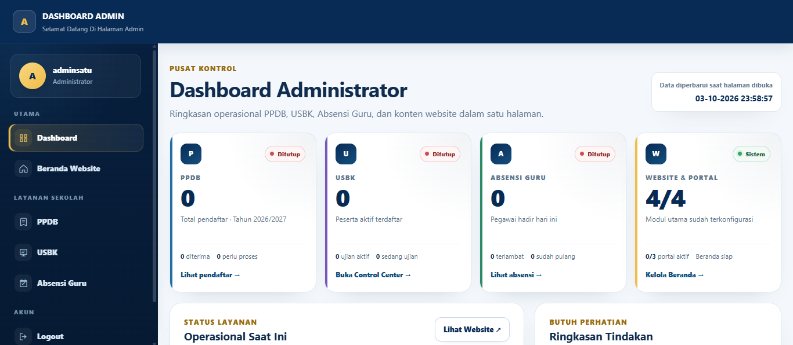

The Windows client uses **Electron + Node.js** as a desktop application layer over the same web platform and backend.

The project intentionally reuses the existing backend and business rules instead of duplicating core logic in each client.

---

## Android Client

The Android application is built with:

- Java
- Android SDK
- Android WebView
- Gradle

It uses the same web platform as the primary interface while keeping Android-specific integration in the application layer.

This is a **hybrid application architecture**, not a separate fully native UI implementation.

A device-specific Android screenshot will be added when a capture that clearly shows the application running inside the Android environment is available.

---

## Technology Stack

| Area | Technologies |
| --- | --- |
| Backend | PHP, CodeIgniter 4 |
| Database | MySQL |
| Frontend | HTML5, CSS3, JavaScript |
| Mobile | Java, Android SDK, Android WebView, Gradle |
| Desktop | Electron, Node.js |
| Version Control | Git, GitHub |
| Security Testing | OWASP ZAP, Nuclei |
| Integration | REST-oriented backend integration |

---

## Core Modules

### Public Website

Responsive public information pages include school profile, academic information, announcements, admission information, examination information, and attendance-related information.

Selected public content can be updated through Live Sync without requiring a full-page refresh.

### PPDB / SPMB

The student admission module includes:

- Dynamic form builder
- Configurable form sections and fields
- Admission paths and quotas
- Registration schedules
- Registration status
- Upload requirements
- Applicant data correction
- Re-registration
- Document handling
- Audit records

Dynamic configuration reduces the need to hard-code a new registration form for each admission period.

### USBK

The examination module includes:

- Participant management
- Examination configuration
- Schedules
- Announcements
- Rules
- Waiting room
- Examination session handling

Active examination states are protected from unsafe full-page synchronization so answers, timers, navigation state, and submission workflows are not overwritten.

### GPS-Based Teacher Attendance

The attendance module includes:

- Check-in
- Check-out
- GPS acquisition
- Location-accuracy handling
- Attendance status
- Late attendance handling
- Duplicate attendance protection

Informational synchronization is separated from active GPS and submission operations.

### Live Sync

Live Sync is used selectively for public information such as:

- Home content
- School profile
- Academic information
- Announcements
- PPDB information, schedules, quotas, and status
- Attendance information
- USBK portal information, schedules, and announcements

Interactive states such as partially completed admission forms, GPS submission, and active examinations are deliberately protected.

### Image Processing

The project includes reusable image-upload processing with:

- Automatic WebP conversion
- File-size optimization
- Reusable upload handling
- Administrative image replacement

---

## High-Level Architecture

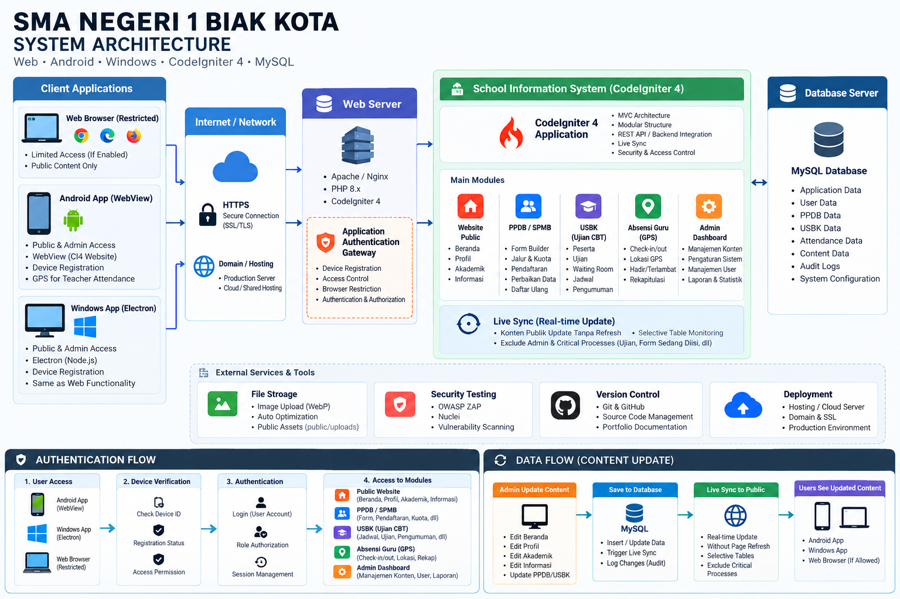

The diagram above summarizes how web, Android, and Windows clients connect to the CodeIgniter 4 backend, shared application modules, Live Sync services, and MySQL storage.

More detail: [System Architecture](docs/architecture.md)

---

## Authentication & Access Flow

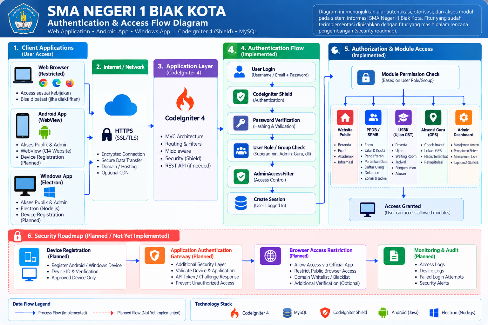

The current implementation uses **CodeIgniter Shield** for authentication together with role/group checks and administrative access filters before protected modules are reached.

The diagram also separates the **planned security roadmap** from the implemented authentication path. Planned items include stronger device registration, application-only access controls, and browser restriction mechanisms.

---

## Security Engineering

Security is treated as part of the development lifecycle rather than as a final standalone step.

Implemented and verified areas include:

- Authentication
- Authorization
- Access control
- CSRF protection
- Server-side validation
- Output handling
- File-upload validation
- Administrative access filtering
- Security testing
- Vulnerability assessment

Security tools used during development include **OWASP ZAP** and **Nuclei**.

Planned security work includes stronger device verification, application-authentication gateway controls, and browser-access restriction. These roadmap items are intentionally distinguished from features already implemented in the current source.

More detail: [Security Overview](docs/security-overview.md)

---

## Engineering Approach

The project follows a conservative maintenance strategy:

1. Preserve stable business logic whenever possible.
2. Identify the root cause before changing code.
3. Prefer small, targeted changes over broad rewrites.
4. Validate behavior after implementation.
5. Keep server-side rules authoritative.
6. Protect active user workflows from unsafe synchronization.
7. Test on the actual target environment when practical.
8. Keep production secrets and personal data out of public repositories.

---

## My Role

**Full-Stack Web & Application Developer**

Responsibilities include:

- Backend development
- Frontend development
- Database integration
- Dynamic-form implementation
- Administration dashboard development
- Android application integration
- Windows desktop application integration
- REST/backend integration
- Debugging
- Performance optimization
- Security testing
- Git and GitHub workflow
- Deployment preparation
- Iterative system maintenance

---

## Technical Challenges

Key engineering challenges addressed during development include:

- Integrating multiple operational modules into one application
- Building configurable admission workflows
- Preserving user state during live synchronization
- Managing examination state safely
- Integrating GPS-based attendance
- Supporting responsive desktop and mobile access
- Automatically optimizing uploaded images
- Reusing one backend across browser, Android, and Windows clients
- Improving security without breaking established business logic

---

## Documentation

Detailed technical documentation is available in:

- [Features](docs/features.md)
- [System Architecture](docs/architecture.md)
- [Security Overview](docs/security-overview.md)

---

## Privacy and Repository Scope

This public portfolio does **not** include:

- Student personal data
- Teacher personal data
- Production database dumps
- Registration documents
- Examination answers
- GPS attendance records
- `.env` files
- Database credentials
- API tokens
- Private cryptographic keys
- Android signing keys
- Administrative credentials
- Detailed production security configuration

---

## Project Status

**Active Development / Private Production-Oriented System**

The complete application source and production configuration are maintained privately.

This repository exists specifically as a professional engineering portfolio and technical documentation showcase.

A controlled demonstration may be provided on request where appropriate.

---

## Developer Profile

**Full-Stack Web & Application Developer**

`PHP` · `CodeIgniter 4` · `MySQL` · `JavaScript` · `HTML` · `CSS` · `Android WebView` · `Electron` · `REST API` · `Application Security` · `Git` · `GitHub`
